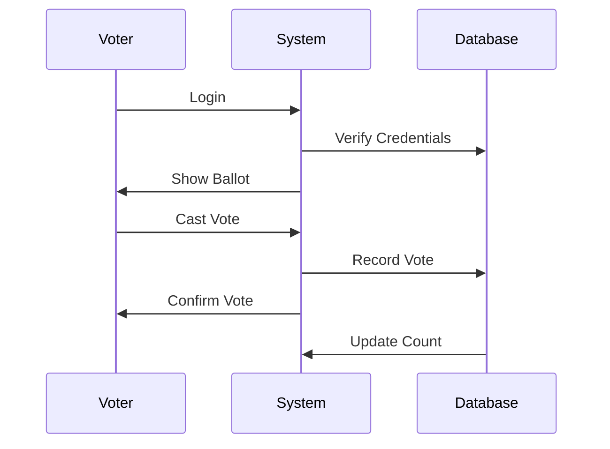
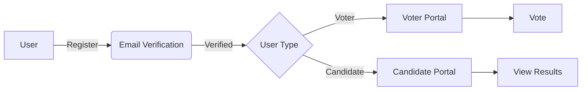

# 🗳️ Secure Online Voting System

A robust and secure web-based voting platform built with modern technologies to enable transparent and efficient electoral processes.

## ✨ Features

- 🔐 Secure Authentication System
  - Separate login portals for voters and candidates
  - Password encryption using bcrypt
  - Session management with Passport.js

- 👥 User Management
  - Voter registration with email verification
  - Candidate registration with special access codes
  - Constituency-based voter and candidate mapping

- 🗳️ Voting System
  - One-time voting mechanism
  - Real-time vote counting
  - Prevention of double voting
  - Constituency-based ballot generation

- 📊 Results & Analytics
  - Real-time vote counting
  - Party-wise vote distribution
  - Interactive charts and statistics
  - Constituency-wise results


## 🛠️ Technology Stack

- **Backend**
  - Node.js
  - Express.js
  - MongoDB
  - Passport.js (Authentication)
  - Bcrypt.js (Encryption)
  - Nodemailer (Email Service)

- **Frontend**
  - EJS Templates
  - Bootstrap 4
  - Font Awesome
  - Chart.js (Statistics)

## 📦 Prerequisites

- Node.js >= 12.x
- MongoDB
- npm or yarn
- Gmail account (for email notifications)

## 🚀 Getting Started

1. **Clone the repository**
```bash
git clone https://github.com/yourusername/voting_system.git
cd voting_system
```

2. **Install dependencies**
```bash
npm install
```

3. **Configure environment**
   - Create a `.env` file in the root directory
   - Add the following configurations:
```env
PORT=9000
MONGODB_URI=your_mongodb_connection_string
EMAIL_USER=your_gmail_address
EMAIL_PASS=your_gmail_app_password
SESSION_SECRET=your_session_secret
```

4. **Start the application**
```bash
npm start
```

The application will be available at `http://localhost:9000`

## 🗄️ Project Structure

```
voting_system/
├── app.js              # Application entry point
├── db.js              # Database configuration
├── models/            # Database models
│   └── user.js       # User model schema
├── passport/         # Authentication strategies
├── routes/          # Application routes
├── views/           # EJS templates
└── public/          # Static assets
```

## 🔒 Security Features

- Password Hashing (bcrypt)
- Session Management
- CSRF Protection
- Email Verification
- Access Control
- One-time Voting Mechanism

## 📊 Vote Flow Diagram



## 🛡️ Authentication Flow



## 👥 Contributing

Contributions are welcome! Please feel free to submit a Pull Request.

## 📝 License

This project is licensed under the MIT License - see the [LICENSE](LICENSE) file for details.

## 🤝 Support

For support, please open an issue in the repository or contact the maintainers.

---
⭐ Don't forget to star this repository if you found it helpful!